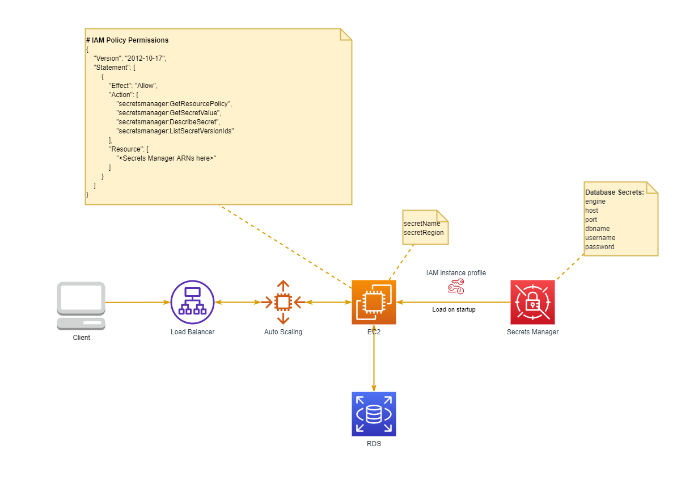

# springboot-aws-ec2-rds
SpringBoot AWS EC2 RDS

This sample project demonstrates how to use AWS secret manager service with spring-boot framework as application properties configuration, such as database credentials

## What's wrong with legacy database credentials configuration

- Security  
Hardcode database credentals, or any credentals is a critical security leak.  
- Multi environments  
Sometimes, We have to move our systems to another AWS account. That means database credentals change (mostly database endpoint). So we must change code to adapt this migration! That is not a good idea!

## How does it work?

We store RDS credentials in Secrets Manager and Spring Boot application will load it at startup.  
We only need to know secretName and which region secrets create in.  
To grant EC2 instance (Spring Boot) reading Secrets Manager, we use IAM Role, IAM Policy and Instance Profile.   
**Never hard code AWS credentials in your code!**

## TODO
[x] Optional use Secrets Manager  
[] Test code  
[] Use region as an environment  
[x] Database Read Replicas
[] Support Docker, Docker compose

